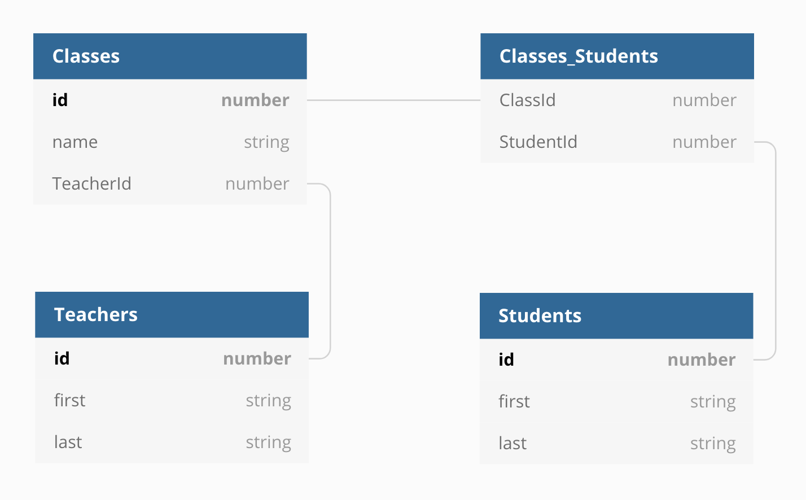

# TypeScript + Sequelize v5 Example Project
This project aims to demonstrate basic usage of [Sequelize](http://docs.sequelizejs.com/) in conjunction with TypeScript and Node.js. There are many examples out there, but few deal with version 5 of Sequelize, which comes with its own typing. If you find any issues or ways to improve it, let me know!

## Format
The example consists of a simple database layout with three entity types: students, teachers, and classes.



Each class belongs to one teacher, and there is a many-to-many association between students and classes. Interaction with the database is handled by a simple API powered by Express.

## Running the Project
While this project is intended mostly to provide guidance, it does run! To run the example, you will need [Docker Desktop](https://www.docker.com/products/docker-desktop) and [Node.js](https://nodejs.org/). With these installed, simply clone the repository and run
```
npm install
```
in the root directory. The `npm` commands in `package.json` function as follows:
  - `attached` - Run the server and database in the foreground of your console
  - `background` - Run the server and database in the background
  - `logs` - View console output of the background processes
  - `populate` - After the database and server are fully initialized, running this will insert sample data into the database
  - `stop` - Stop the killed or backgrounded docker process

The API is documented lightly in the source code.
